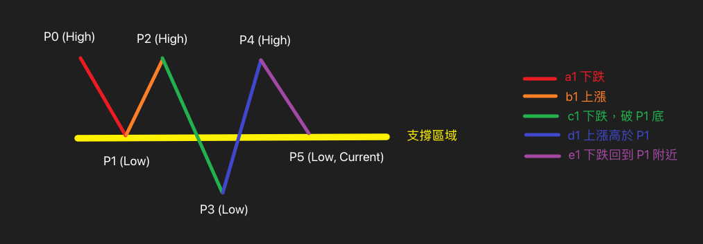

# Feature Specification: 自動股票篩選網站

**Feature Branch**: `001-daily-screener`  
**Created**: 2026-04-11  
**Status**: Draft  
**Input**: User description: "建立一個台灣時間每日 15:00 自動篩選台股上市股票和美股納斯達克交易所股票的網站"

## User Scenarios & Testing _(mandatory)_

### User Story 1 - 瀏覽每日篩選結果清單 (Priority: P1)

作為一個個人投資者，我希望能夠在網站上直接看到符合「老余三問（位置、慣性、圖）」邏輯的股票清單，以便我可以快速鎖定具潛力的標的，而不需要自己手動分析幾千檔股票。

**Why this priority**: 這是平台最核心的價值，若無法直接展現篩選結果，整個系統就失去意義。

**Independent Test**: 可在給定一份假的（mock）股票篩選完成資料時，於前端網站順利顯示結果，並能確認列表上包含股票名稱、代號以及有效的 TradingView 跳轉連結。

**Acceptance Scenarios**:

1. **Given** 系統已經完成了當日的股票篩選，**When** 我打開網站首頁，**Then** 我會看到今日符合篩選條件的股票列表，包含股票代號、名稱及 TradingView 連結。
2. **Given** 我在篩選結果列表頁面上，**When** 我點擊某檔股票的 TradingView 連結，**Then** 瀏覽器會在新的分頁開啟並跳轉到該股票的 TradingView K 線圖頁面。

---

### User Story 2 - 切換查看歷史篩選紀錄 (Priority: P2)

作為一個個人投資者，我希望可以在網站首頁直接透過點擊按鈕切換不同的日期，以頁面切換的方式來查看最近 5 個工作天內任何一天的選股結果，首頁預設為當天的內容。

**Why this priority**: 雖然依賴當日資料是最核心的，但提供 5 天的歷史紀錄能大幅幫助使用者回測和檢視前幾天的盤後結果，為必然需要的輔助功能。

**Independent Test**: 前端介面提供固定天數（如「當天」、「前1天」...「前4天」）的相對日期按鈕切換功能，點擊後能以頁面切換（Routing）的方式，帶入固定的相對天數參數（例如 `offset`）取得對應資料並正確渲染。

**Acceptance Scenarios**:

1. **Given** 系統已經累積了過去一週的資料，**When** 我在網站首頁上查看日期切換區塊，**Then** 我只能看到代表「當天」至「前4天」的五個相對日期按鈕。
2. **Given** 我點擊了「前1天」的日期按鈕，**When** 系統透過 Next.js App Router 進行頁面切換載入後，**Then** 網址會更新為帶有固定參數的連結（例如 `/?offset=1`），且畫面上的股票清單會變更為該特定日期的篩選結果。

---

### User Story 3 - 系統每日自動執行盤後篩選 (Priority: P1)

作為一個被動的使用者，我希望系統能夠在台灣時間每天的下午 15:00 自動去抓取台股以及美股納斯達克的收盤資料，並自動跑完篩選邏輯更新網站資料，而不需要我手動觸發。

**Why this priority**: 達到「自動化」與「無需人為介入」的承諾，減少使用者的營運與操作成本。

**Independent Test**: 可透過設定定時排程系統（例如作業系統 cron 或雲端排程工具等）測試是否在指定時間自動呼叫腳本、完成資料處理並產出結果。

**Acceptance Scenarios**:

1. **Given** 台灣時間到達下午 15:00 且收盤資料已可取得，**When** 系統定時排程觸發，**Then** 系統會自動抓取最新的盤後資料。
2. **Given** 系統檢查發現當日為休市或無最新資料（包含納斯達克未更新），**When** 排程執行時，**Then** 系統會暫停後續篩選動作，並在網站上註明「資料未更新」或「休市」。
3. **Given** 系統在與資料來源 API 連線時發生逾時或失敗，**When** 抓取資料失敗，**Then** 系統會自動進行重試，最多重試 3 次。
4. **Given** 系統正處於長時間的抓取過程中（例如 15:00 至 17:00 間），**When** 我開啟網站首頁，**Then** 頁面上會分別獨立顯示「台股：資料抓取中」與「美股：尚未開始 / 資料抓取中」的即時狀態提示。
5. **Given** 系統成功取得了盤後資料並完成篩選，**When** 狀態寫入完成，**Then** 網站上的對應市場狀態會切換成「已完成」，並顯示出最新的篩選結果清單至網站可讀取的狀態。

---

### Edge Cases

- 由於已明確定義發生休市或資料未更新時終結流程，並設定最多 3 次連線重試。若重試 3 次後仍全數失敗，系統該如何通知或處理？（已確定解法：在排程系統端保留錯誤日誌，且會產出一份狀態供前端讀取，使網頁上的對應市場狀態直接顯示為「更新失敗」。對使用者而言，直接在網站看到錯誤狀態是最佳的體驗）。

## Requirements _(mandatory)_

### Functional Requirements

- **FR-001**: 系統必須每天在台灣時間 15:00 固定自動執行並更新篩選流程。
- **FR-002**: 系統的抓取範圍必須包含「台股上市股票」與「美股納斯達克交易所股票」。
- **FR-003**: 系統只允許抓取並處理「收盤後」的資料，不處理盤中即時資料。
- **FR-004**: 系統必須實作以下的「老余三問」股票篩選核心邏輯，每次篩選須確保取得最近 200 根日 K 以及 200 根週 K 資料作爲分析基礎：
  - **位置**: 判斷週線處於下邊界（多方大本營）。
  - **慣性**: 判斷週線 K 棒出現長下影線（價格下不去），且日線 K 棒走勢由跌多漲少轉變成漲多跌少。
  - **圖**: 判斷日線 K 棒走勢符合「破底翻」型態（定義為呈現 P0 - P5 波動，且 P5 可與 P1 有輕微上下落差，但 P5 不得接近 P3）。
- **FR-005**: 系統網站必須提供一個能檢視最近 5 個工作天篩選結果的切換介面。
- **FR-006**: 篩選結果列表必須只顯示：股票名稱、股票代號，以及跳轉至 TradingView 的連結。網站內不需要實作或嵌入 K 線圖。
- **FR-007**: 整個系統的架構必須採用完全免費的無伺服器方案建置與營運（達成 0 成本目標），包含資料的抓取、運算、儲存與前端介面託管，均不得依賴任何需支付固定月費的雲端基礎設施。
- **FR-008**: 系統在 15:00 執行時，必須先檢查市場當日是否休市或有無新盤後資料。若休市或無新資料（含納斯達克資料未更新），需暫停後續計算與篩選，並在網站上明確標示「資料未更新」或「休市」。
- **FR-009**: 當資料來源 API 抓取失敗或連線逾時，系統必須最多進行 3 次重試機制。
- **FR-010**: 網站必須具備追蹤與顯示「資料更新狀態」的功能。考量到抓取時間可能橫跨兩小時以上，網站上必須針對「台股」與「美股（納斯達克）」的狀態「分開獨立顯示」（如：抓取中、已抓取完成、更新失敗、休市）。

### 參考圖例

- 破底翻型態（老余三問）：
  
  _(註：圖片請協助存放至 `specs/001-daily-screener/assets/pattern.png` 即可正常顯示)_

### Key Entities

- **StockAsset**: 記錄單一股票的代號、名稱、市場別（台股/納斯達克）與 TradingView URL 的基礎資訊。
- **ScreeningResult**: 記錄特定日期符合「老余三問」篩選條件的 `StockAsset` 陣列集合。

## Success Criteria _(mandatory)_

### Measurable Outcomes

- **SC-001**: 每天系統能自動在 15:00 執行排程，成功率達 99% 以上。
- **SC-002**: 網站的伺服器成本、資料庫雲端成本與排程計算成本為 $0 / 月。
- **SC-003**: 使用者載入網站與切換日期結果的速度，在常規網路下小於 3 秒。
- **SC-004**: 篩選出來的股票結果，人工抽測比對其 K 線圖型態，完全符合需求中定義的破底翻與長下影線特徵。

## Assumptions

- 假設將透過免費且支援定時觸發的無伺服器運算服務進行自動化排程計算，並透過免費的新一代靜態網頁託管服務來展示網站，藉此確保 $0 成本營運的要求。
- **資料來源 API 可行性假設**：假設市場上存在提供免費且穩定的盤後數據 API（且單一可靠來源即可涵蓋單一市場需求而不需混用多個來源以避免資料衝突），只要妥善設計批量抓取或控制呼叫頻率，即可完美避開免費方案之速率限制，並以 0 成本取得歷史及最新的所需的資料。
- **資料庫可行性假設**：考量到「每日將篩選結果的 JSON 寫回版本控制系統」會導致過多不必要的 Commit 污染開發歷史紀錄，此方案雖免費但在維護上並不理想。因此假設將採用具備充裕免費額度的主流 Serverless 資料庫服務。由於本專案業務邏輯僅需儲存「近 5 天」且「符合特定型態條件的少數股票清單」，其產生的儲存空間與讀寫次數極小，能夠輕易且安全地運作於任何 Serverless DB 的免費專案限制之內，順利達成 0 成本資料庫儲存的目標。
- 設定抓取 200 根日 K 與 200 根週 K 資料量極小，不僅足以涵蓋判斷「破底翻（約 10 個月行情）」與「週線下邊界（約 4 年行情）」所需的歷史區間，且在呼叫多數金融 API 時，傳輸 200 筆資料與 50 筆資料的封包大小和處理伺服器響應時間幾乎無異，完全不會延長整體排程的執行時間。
- 網站為個人選股使用，不包含會員登入機制、不需要SEO處理、亦沒有併發高流量的壓力。
